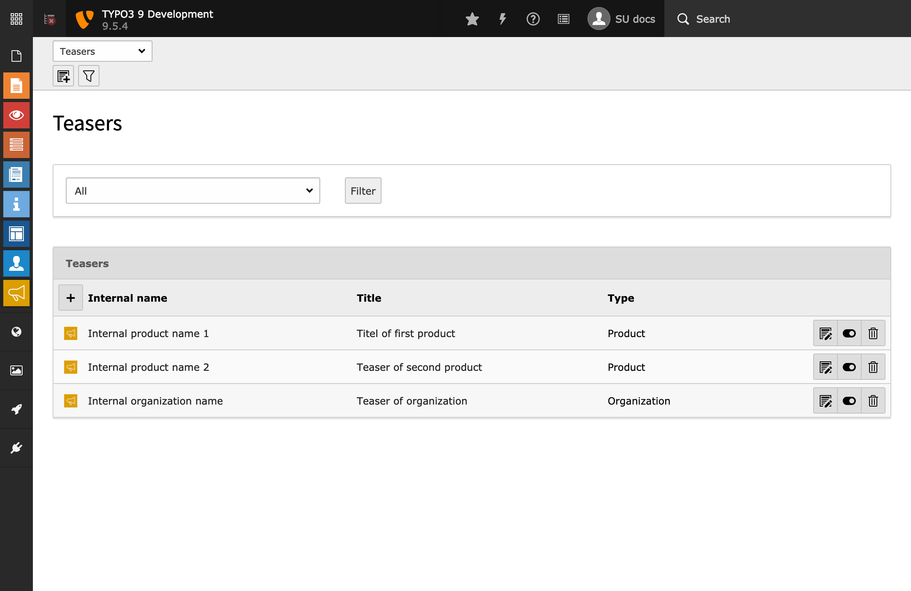
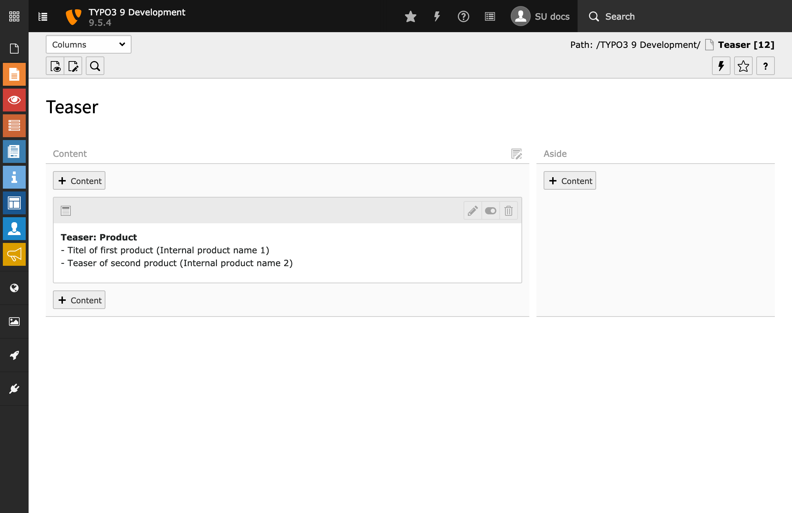

.. ==================================================
.. FOR YOUR INFORMATION
.. --------------------------------------------------
.. -*- coding: utf-8 -*- with BOM.

.. include:: ../Includes.txt

.. _introduction:

Introduction
============

.. _what-it-does:

What does it do?
----------------

This TYPO3 extension provides a backend module that allows you to manage teasers in a central place and use them
wherever you need them.

.. _screenshots:

Screenshots
-----------

Create teasers in the provided backend module and use them everywhere on your website.

   Backend module provided by teaser_manager

   Use the provided backend module to create teasers, teaser types and teaser layouts.

   Plugin preview

   Get a nice preview of the teasers you selected
